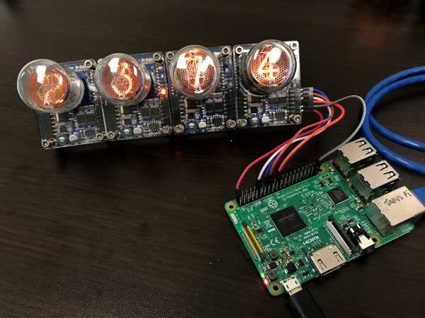

# PiNixie
Python module to drive 74HC595 based Nixie modules using Raspberry Pi.

Unlike other Raspberry Pi projects that require an additional Arduino board, PiNixie drives the Nixie module directly to keep things very simple.

## Nixie "Arduino Compatible" Modules

These Nixie modules are plentiful on Ebay, Amazon, etc. and are typically called "Arduino compatible". They make it easy for the maker because the high-voltage boost circuit and serial to parallel conversion is built in. By using a 74HC595 or similar shift register, a (nearly) unlimited number of digits can be controlled with 4 GPIO pins of the Raspberry Pi.

This module was written using the QS30-1 from nixieclock.org as a reference. This module is stackable for multipe digits and has an RGB LED backlight.

http://www.nixieclock.org/?p=566

## Wiring

## Command String

## FAQs

